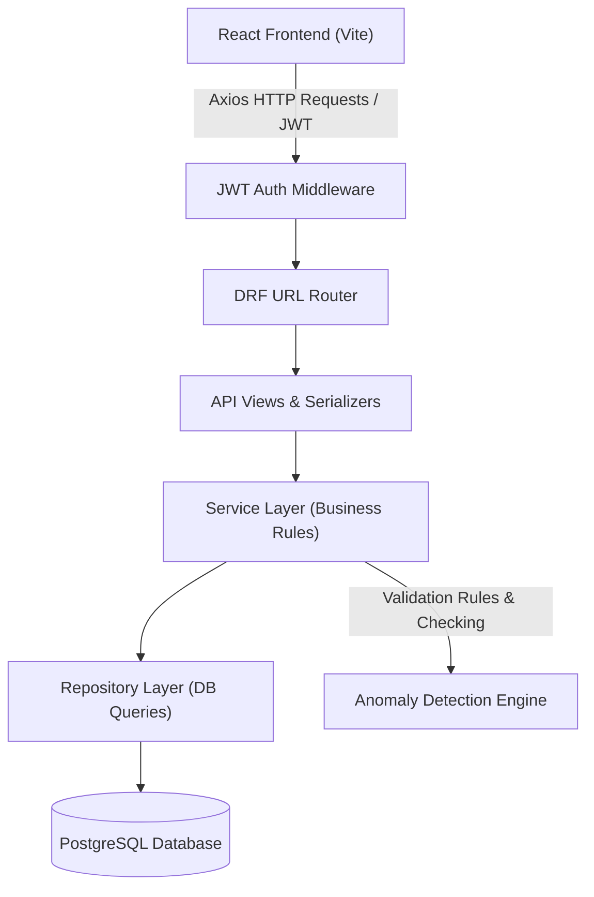
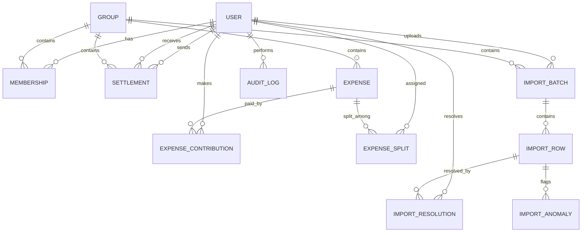

# AI Context: Shared Expense Management Application

## Project Overview
A Shared Expense Management Application similar to Splitwise, developed as a Software Engineering Internship Assignment.

## Document Status
- **Last Updated:** 2026-06-14
- **Current Phase:** Backend Development (Groups & Memberships)

---

## 1. Product Discovery

### Product Goals
- **Core Objective:** Manage shared expenses for groups where membership can change dynamically over time.
  - Supports roommates managing ongoing household expenses (rent, utilities, groceries, etc.).
  - Supports temporary groups (trips, vacations, events).
  - Must calculate balances correctly when members join or leave groups.
  - **Exclusion:** Not intended for business expense reimbursement or corporate accounting.
- **CSV Import & Anomaly Detection:**
  - Import historical expense records from messy spreadsheets.
  - Detect inconsistencies/data quality issues and surface them to users (transparency over automation).
  - Allow users to review and approve/reject corrections.
  - Maintain a complete audit trail of all actions and decisions.
  - **No Silent Modification:** The system must never silently modify data.

### User Personas
- **Persona A (Casual Expense Splitter):** Friends splitting bills (dinners, trips, events). Needs fast expense entry, equal/percentage splits, clear balances, and a mobile-responsive interface. Primary goal: Know who owes whom and settle quickly.
- **Persona B (Household / Roommate Manager):** Long-term living arrangements (flatmates, shared apartments). Needs ongoing expense tracking, dynamic membership dates (join/leave dates), utility/recurring expenses, detailed balance breakdowns, and history. Primary goal: Maintain fair and accurate balances over time.
- **Persona C (Data Reviewer / Meera):** User responsible for reviewing imports. Needs visibility into anomalies, approval/rejection workflows, audit history, and import reports. Primary goal: Ensure imported data remains trustworthy.

### Success Criteria
- **Functional Success:**
  1. Group creation and management.
  2. Tracking membership changes (dates of joining/leaving).
  3. Expense creation, updates, and deletion.
  4. Record settlements.
  5. Multiple split types (e.g., equal, percentage).
  6. Accurate group and individual balances.
  7. Historical CSV imports.
  8. Every anomaly surfaced to users; none silently ignored.
  9. Detailed import reports generated for every import.
  10. Complete action auditability.
- **Balance Calculation Success:**
  - `Total Credits = Total Debits` (Group balance sum = 0).
  - Membership dates respected (users charged only for expenses during active membership).
  - Consistent currency conversion.
  - Minimization and documentation of rounding errors.
- **Technical Success:**
  - **Backend:** Django REST Framework, PostgreSQL.
  - **Frontend:** React, Vite, Tailwind CSS.
  - **Auth:** JWT.
  - **Deployment:** Publicly deployed backend and frontend.
  - **Performance Targets:** CSV imports <10s for the assignment dataset, dashboard load <3s, and fast API response times.
- **CSV Import Success:**
  1. File structure validation passes.
  2. All anomalies detected and surfaced.
  3. Suggested actions displayed.
  4. User approvals recorded.
  5. Imported data stored correctly.
  6. Import report generated.
  7. Audit log generated.

---

## 2. Product Scope & Features

### Core Entities & Domain Decisions

#### A. Dynamic Group Memberships
- **Join/Leave Date Logic (Option A):** 
  - Every membership record contains `joined_at` and `left_at` (nullable).
  - A member can only participate in expenses whose transaction date falls within their active membership period.
  - **Backend Enforcement:** Mandatory backend validation to reject expenses outside a user's active membership period.
- **Leaving with Non-Zero Balances:**
  - Allowed. Inactive members can leave with non-zero balances.
  - The debt continues to exist, and balances are calculated using historical expenses and settlements.
  - Inactive users are excluded from *future* expenses but remain part of past balance calculations.
- **Re-joining:**
  - Allowed. A user can leave and rejoin the same group later, creating multiple active membership periods (multiple records in the database).
- **Membership Roles:** 
  - Every membership is assigned a role: `OWNER`, `ADMIN`, or `MEMBER`.
  - Permissions control access to group management, CSV import approvals, and administrative audit logs.

#### B. Expense Models & Splits
- **All Expenses in Groups:** Every expense must belong to a group. Direct one-to-one expenses outside a group are out of scope.
- **Multiple Payers:** Supported. An expense can be paid by multiple people.
  - *Structure:* Tracked via an `ExpenseContribution` model (who paid what portion) rather than a single `paid_by` field.
- **Supported Split Types:**
  1. **Equal Split:** Calculated evenly among all split participants.
  2. **Percentage Split:** Split specified as percentages (must sum to 100%).
  3. **Exact Amount Split:** Split specified as exact amounts (must sum to total expense amount).
  4. **Shares/Ratio Split:** Split specified in shares/ratios (total shares calculated dynamically).
  - *Extensibility:* The database schema must use a flexible design (e.g., `Expense`, `ExpenseSplit`, `SplitStrategy`) to support new split types.
- **Soft Deletion:** Core financial records are never physically deleted. Deleting an expense flags it as `is_deleted = True` and sets `deleted_at`.

#### C. Settlements
- **Data Representation:** Separate entity from `Expense`.
  - fields: `from_user`, `to_user`, `amount`, `currency`, `settlement_date`, `group`.
- **Validation Rules:**
  - Positive amounts only.
  - Exactly one payer (`from_user`) and one receiver (`to_user`).
  - No split strategies or distributions.
  - Cannot reference inactive users at the time of settlement date (cannot settle if outside active membership period).
  - Must belong to a group.
- **Verification Workflow:**
  - No approval workflow required; settles immediately affect balances.
  - Triggers recalculation, adds to history, and logs to audit.
- **Soft Deletion:** Deleting a settlement records flags it as `is_deleted = True` and sets `deleted_at`.

#### D. Balance Rules
1. **Zero-Sum:** Group balances must always sum to zero (`Total Credits = Total Debits`).
2. **Historical Persistence:** Historical expenses remain valid even after a member leaves.
3. **Period Boundaries:** Membership periods only affect future participation.
4. **Settlement Modification:** Settlements reduce balances but never modify expense history.
5. **Pre-conversion:** Currency conversion should occur before balance calculations.
6. **Traceability:** Every balance must be traceable to underlying expenses and settlements.
7. **Bilateral Cache Snapshots:** Balances are calculated dynamically for the MVP, but a cached snapshot layout (`BalanceSnapshot`) is maintained to future-proof database scalability.

---

### CSV Import & Anomaly Detection Specifications

#### A. CSV File Structure
- **Required Columns:** `Date`, `Description`, `Amount`, `Currency`, `Paid By`, `Split Type`, `Participants`, `Split Values`, `Notes`
- **Optional Columns:** `Category`, `External Reference`, `Import Source`
- **User Identification:** Users are identified in CSV by name (e.g., Aisha, Rohan). 
  - *Matching Logic:* 1. Exact match -> 2. Case-insensitive match -> 3. Alias matching -> 4. Flag as "Unknown Member" anomaly.
  - *Constraint:* No automatic user creation on matching failure.

#### B. Anomaly Definitions & Confidence Signals
- **Duplicate Expense:** Identical `Date`, `Payer`, `Amount`, `Group`, `Participants`.
  - *High Confidence:* All fields match exactly.
  - *Medium Confidence:* Same date, similar description, amount difference < 5%.
  - *Action:* Flag for review. Never automatically delete.
- **Conflicting Duplicate Entry:** Appears to represent the same real-world event but with conflicting values (e.g., "Dinner at Marina" ₹2400 vs "Marina Dinner" ₹2450 on the same date).
  - *Action:* Reviewer chooses Keep A, Keep B, Keep Both, or Merge.
- **Settlement entered as Expense:** Detects if an expense actually represents debt repayment.
  - *Signals:* Keywords ("settle", "settlement", "repay", "reimbursement", "transfer", "paid back", "returned", "deposit paid"), only two participants, split pattern/notes implying repayment.
  - *Action:* Recommend "Convert to Settlement". Reviewer confirms.
- **Unknown Member:** CSV participant does not map to a database/group user.
  - *Action:* Reviewer can map to an existing user, create a new user, or skip the row.
- **Membership Timeline Violation:** Expense date falls outside active membership dates.
  - *Action:* Flag anomaly. Reviewer can remove member, adjust date, or keep and override.
- **Invalid Currency:** Currency missing or unsupported.
  - *Action:* Recommend group default currency (e.g., INR). Reviewer must approve or skip row.
- **Invalid Date:** Date is unparseable or ambiguous (e.g. `04-05-2026` could be April 5 or May 4).
  - *Action:* Require review/clarification.
- **Negative Amount:** Amount is negative (refund, correction, or error).
  - *Action:* Recommend "Convert to Refund Transaction" or "Keep Negative Expense".
- **Incorrect Split Configuration:**
  - Percentage Split: Sum != 100%.
  - Exact Split: Sum != total amount.
  - Share Split: Shares are negative or sum to 0.
  - Equal Split: Participants do not exist.
  - *Action:* Flag for manual correction.

#### C. Staging Table Workflow (Option A)
1. **Upload CSV** -> Creates `ImportBatch`.
2. **Parse Rows** -> Creates `ImportRow` records in staging tables.
3. **Run Validation Engine** -> Identifies anomalies and creates `ImportAnomaly` records.
4. **Interactive Review** -> User reviews staging data and selects resolutions. Resolutions are stored in `ImportResolution`.
5. **Approve Import** -> Converts valid/resolved staging records into live `Expense` and `Settlement` records.
6. **Generate Reports & Logs** -> Outputs downloadable reports and logs audit events.

#### D. Import Report Deliverables
- **Format:** Interactive UI view, downloadable PDF, and downloadable CSV.
- **Contents:**
  - *Summary:* Import date, uploader, total rows.
  - *Stats:* Successful rows, failed rows, warning rows, total anomalies found.
  - *Breakdown:* Count of anomalies by type.
  - *Resolution Summary:* Log of every anomaly detected and the action taken (who, what, when).
  - *Status:* Success, Partial Success, or Failed.

#### E. Audit Logs
- **Storage:** Stored in the database.
- **Events Logged:** CSV Uploaded, Anomaly Detected, User Mapping, Duplicate Merge, Settlement Conversion, Import Approved, Import Rejected, Expense Created, Settlement Created, Member Added, Member Removed.
- **Fields:** `id`, `actor`, `event_type`, `entity_type`, `entity_id`, `old_value`, `new_value`, `timestamp`.
- **Access Control:** Reviewers and Group Owners have full access; regular members have read-only access to audit events affecting their balances.

---

## 3. Architecture & Technical Decisions

### Tech Stack Layers (Backend)
- **Django REST Framework (DRF)**
- **Architecture Pattern:** Controller (API Views/Serializers) → Service Layer (Business Logic / Validations) → Repository Layer (Querying Database) → Database (PostgreSQL).
- **Core Benefit:** Complete separation of business rules (e.g. split engine, dynamic membership checks) from API endpoints. Highly testable.

### Tech Stack (Frontend)
- **React + Vite + Tailwind CSS**
- **Libraries:**
  - `React Router` (Routing)
  - `TanStack Query` (State & caching of API requests)
  - `Axios` (HTTP client)
  - `React Hook Form` (Form state & validation)

### Database Schema (Relational Tables)

#### `User`
- Standard Django auth User fields.

#### `Group`
- `id` (UUID)
- `name` (String)
- `base_currency` (String, default 'INR')
- `created_at` (Timestamp)

#### `Membership`
- `id` (UUID)
- `group_id` (FK → Group)
- `user_id` (FK → User)
- `joined_at` (Timestamp)
- `left_at` (Timestamp, nullable)

#### `StaticExchangeRate`
- `id` (Integer)
- `from_currency` (String, e.g. 'USD')
- `to_currency` (String, e.g. 'INR')
- `rate` (Decimal)

#### `Expense`
- `id` (UUID)
- `group_id` (FK → Group)
- `description` (String)
- `date` (Date)
- `original_amount` (Decimal)
- `converted_amount` (Decimal)
- `currency` (String)
- `exchange_rate` (Decimal)
- `split_type` (String: 'equal', 'percentage', 'exact', 'shares')
- `created_at` (Timestamp)

#### `ExpenseContribution`
- `id` (UUID)
- `expense_id` (FK → Expense)
- `user_id` (FK → User)
- `amount_paid` (Decimal)

#### `ExpenseSplit`
- `id` (UUID)
- `expense_id` (FK → Expense)
- `user_id` (FK → User)
- `share_value` (Decimal) -- e.g., percentage, share ratio, or exact amount
- `amount_owed` (Decimal)

#### `Settlement`
- `id` (UUID)
- `group_id` (FK → Group)
- `from_user_id` (FK → User)
- `to_user_id` (FK → User)
- `original_amount` (Decimal)
- `converted_amount` (Decimal)
- `currency` (String)
- `exchange_rate` (Decimal)
- `settlement_date` (Date)

#### `ImportBatch`
- `id` (UUID)
- `group_id` (FK → Group)
- `uploaded_by` (FK → User)
- `status` (String: 'pending_review', 'completed', 'failed')
- `created_at` (Timestamp)

#### `ImportRow`
- `id` (UUID)
- `batch_id` (FK → ImportBatch)
- `row_index` (Integer)
- `raw_data` (JSON)
- `status` (String: 'pending', 'resolved', 'ignored')

#### `ImportAnomaly`
- `id` (UUID)
- `row_id` (FK → ImportRow)
- `anomaly_type` (String)
- `severity` (String: 'high', 'medium', 'low')
- `message` (Text)
- `suggested_action` (String)

#### `ImportResolution`
- `id` (UUID)
- `row_id` (FK → ImportRow)
- `action_taken` (String)
- `resolved_by` (FK → User)
- `timestamp` (Timestamp)

#### `AuditLog`
- `id` (UUID)
- `actor` (FK → User)
- `event_type` (String)
- `entity_type` (String)
- `entity_id` (UUID)
- `old_value` (JSON, nullable)
- `new_value` (JSON, nullable)
- `timestamp` (Timestamp)

---

### Authentication Strategy
- **JWT Storage:** Tokens are stored in frontend `localStorage`.
- **JWT Lifetimes:** 
  - Access Token: 15 minutes
  - Refresh Token: 7 days
- **Registration:** Fully supported login and signup workflows.

---

### Balance Calculation (Option A: Direct Bilateral Balances)
- **Debt Simplification:** NOT used. Direct peer-to-peer calculations are done to maintain full traceability.
- **Calculation Formula:**
  - For any two users A and B in group G:
    - User A's net balance with User B is calculated as:
      `Sum(A's contributions split with B) - Sum(B's contributions split with A) + Sum(Settlements from B to A) - Sum(Settlements from A to B)`
  - **Membership boundaries:** Sums only run over periods where they both had active membership.
- **Traceability:** Every calculated balance must links directly to the detailed underlying transactions.

---

### Currency Conversion
- **Group Base Currency:** Groups declare a base currency (e.g. INR). 
- **Conversion at Entry:** Expenses added in non-base currency (e.g. USD) are converted to the base currency using a static database registry (`StaticExchangeRate`) at the time of creation.
- **Rate Retention:** Once an expense is saved, its rate and converted amount are frozen.

---
### Seed Command Configuration
- A Django admin seed command creates the default users:
  - Aisha, Rohan, Priya, Meera, Sam, Dev
  - Password: `Password@123`
 ## 3. Architecture & Technical Decisions

### System Architecture Diagram
The system follows a standard decoupled Single Page Application (SPA) architecture. The React frontend communicates with the Django REST Framework (DRF) backend via HTTP/REST using JWT authentication, and the backend is organized around the Service-Repository pattern backed by PostgreSQL.



---

### ER Diagram
Below is the Entity-Relationship Diagram outlining the database structure and relations.



---

### Complete Database Schema (PostgreSQL DDL Reference)

#### `users_user` (Custom User Model)
- Extends standard Django `AbstractUser` to support rich profile metadata and name matching.
- Columns:
  - `id`: INT PRIMARY KEY SERIAL
  - `username`: VARCHAR(150) UNIQUE NOT NULL
  - `email`: VARCHAR(254) NOT NULL
  - `password`: VARCHAR(128) NOT NULL
  - `full_name`: VARCHAR(255) NOT NULL
  - `created_at`: TIMESTAMPTZ DEFAULT NOW() NOT NULL
  - `is_active`: BOOLEAN DEFAULT TRUE NOT NULL

#### `groups_group`
- Groups of users managing expenses together.
- Columns:
  - `id`: UUID PRIMARY KEY DEFAULT gen_random_uuid()
  - `name`: VARCHAR(255) NOT NULL
  - `base_currency`: VARCHAR(3) DEFAULT 'INR' NOT NULL
  - `created_by_id`: INT FOREIGN KEY REFERENCES users_user(id) ON DELETE SET NULL
  - `created_at`: TIMESTAMPTZ DEFAULT NOW() NOT NULL

#### `groups_membership`
- Tracks membership periods and roles for users in groups, supporting multiple disjoint periods.
- Columns:
  - `id`: UUID PRIMARY KEY DEFAULT gen_random_uuid()
  - `group_id`: UUID FOREIGN KEY REFERENCES groups_group(id) ON DELETE CASCADE
  - `user_id`: INT FOREIGN KEY REFERENCES users_user(id) ON DELETE CASCADE
  - `joined_at`: TIMESTAMPTZ NOT NULL
  - `left_at`: TIMESTAMPTZ NULL (null indicates currently active)
  - `role`: VARCHAR(10) DEFAULT 'MEMBER' NOT NULL
  - *Constraints:* Check that `left_at` > `joined_at` if `left_at` is not null. Check that `role` IN ('OWNER', 'ADMIN', 'MEMBER').

#### `expenses_staticexchangerate`
- Stores static exchange rates relative to INR or group base currencies.
- Columns:
  - `id`: SERIAL PRIMARY KEY
  - `from_currency`: VARCHAR(3) NOT NULL
  - `to_currency`: VARCHAR(3) NOT NULL
  - `rate`: NUMERIC(10, 4) NOT NULL
  - *Constraints:* Unique pair (`from_currency`, `to_currency`).

#### `expenses_expense`
- Base record of an expense within a group. Supports soft delete.
- Columns:
  - `id`: UUID PRIMARY KEY DEFAULT gen_random_uuid()
  - `group_id`: UUID FOREIGN KEY REFERENCES groups_group(id) ON DELETE CASCADE
  - `description`: VARCHAR(255) NOT NULL
  - `date`: DATE NOT NULL
  - `original_amount`: NUMERIC(12, 2) NOT NULL
  - `converted_amount`: NUMERIC(12, 2) NOT NULL (converted to base currency)
  - `currency`: VARCHAR(3) NOT NULL
  - `exchange_rate`: NUMERIC(10, 4) NOT NULL
  - `split_type`: VARCHAR(20) NOT NULL (Checks: 'equal', 'percentage', 'exact', 'shares')
  - `is_deleted`: BOOLEAN DEFAULT FALSE NOT NULL
  - `deleted_at`: TIMESTAMPTZ NULL
  - `created_at`: TIMESTAMPTZ DEFAULT NOW() NOT NULL

#### `expenses_expensecontribution`
- Stores amounts paid by contributors towards an expense. Supports soft delete.
- Columns:
  - `id`: UUID PRIMARY KEY DEFAULT gen_random_uuid()
  - `expense_id`: UUID FOREIGN KEY REFERENCES expenses_expense(id) ON DELETE CASCADE
  - `user_id`: INT FOREIGN KEY REFERENCES users_user(id) ON DELETE CASCADE
  - `amount_paid`: NUMERIC(12, 2) NOT NULL
  - `is_deleted`: BOOLEAN DEFAULT FALSE NOT NULL
  - `deleted_at`: TIMESTAMPTZ NULL
  - *Constraints:* Unique pair (`expense_id`, `user_id`) when `is_deleted` is False. `amount_paid` > 0.

#### `expenses_expensesplit`
- Stores shares and resolved amounts owed by participants. Supports soft delete.
- Columns:
  - `id`: UUID PRIMARY KEY DEFAULT gen_random_uuid()
  - `expense_id`: UUID FOREIGN KEY REFERENCES expenses_expense(id) ON DELETE CASCADE
  - `user_id`: INT FOREIGN KEY REFERENCES users_user(id) ON DELETE CASCADE
  - `share_value`: NUMERIC(12, 2) NOT NULL (stores percentage, share ratio, or exact amount depending on split_type)
  - `amount_owed`: NUMERIC(12, 2) NOT NULL (pre-calculated in base currency)
  - `is_deleted`: BOOLEAN DEFAULT FALSE NOT NULL
  - `deleted_at`: TIMESTAMPTZ NULL
  - *Constraints:* Unique pair (`expense_id`, `user_id`) when `is_deleted` is False.

#### `expenses_settlement`
- Peer-to-peer settlement records. Supports soft delete.
- Columns:
  - `id`: UUID PRIMARY KEY DEFAULT gen_random_uuid()
  - `group_id`: UUID FOREIGN KEY REFERENCES groups_group(id) ON DELETE CASCADE
  - `from_user_id`: INT FOREIGN KEY REFERENCES users_user(id) ON DELETE CASCADE
  - `to_user_id`: INT FOREIGN KEY REFERENCES users_user(id) ON DELETE CASCADE
  - `original_amount`: NUMERIC(12, 2) NOT NULL
  - `converted_amount`: NUMERIC(12, 2) NOT NULL
  - `currency`: VARCHAR(3) NOT NULL
  - `exchange_rate`: NUMERIC(10, 4) NOT NULL
  - `settlement_date`: DATE NOT NULL
  - `is_deleted`: BOOLEAN DEFAULT FALSE NOT NULL
  - `deleted_at`: TIMESTAMPTZ NULL
  - `created_at`: TIMESTAMPTZ DEFAULT NOW() NOT NULL
  - *Constraints:* `from_user_id` != `to_user_id`. `original_amount` > 0.

#### `expenses_balancesnapshot`
- Future scalability cache snapshot representing peer-to-peer balance for quick loading.
- Columns:
  - `id`: UUID PRIMARY KEY DEFAULT gen_random_uuid()
  - `group_id`: UUID FOREIGN KEY REFERENCES groups_group(id) ON DELETE CASCADE
  - `user_a_id`: INT FOREIGN KEY REFERENCES users_user(id) ON DELETE CASCADE
  - `user_b_id`: INT FOREIGN KEY REFERENCES users_user(id) ON DELETE CASCADE
  - `balance`: NUMERIC(12, 2) NOT NULL
  - `updated_at`: TIMESTAMPTZ DEFAULT NOW() NOT NULL
  - *Constraints:* Unique combination (`group_id`, `user_a_id`, `user_b_id`). Check `user_a_id` < `user_b_id` (enforces sorted pairs).

#### `imports_importbatch`
- Tracks metadata of uploaded CSV sheets. Utilizes import status state machine enums.
- Columns:
  - `id`: UUID PRIMARY KEY DEFAULT gen_random_uuid()
  - `group_id`: UUID FOREIGN KEY REFERENCES groups_group(id) ON DELETE CASCADE
  - `uploaded_by_id`: INT FOREIGN KEY REFERENCES users_user(id) ON DELETE SET NULL
  - `status`: VARCHAR(20) DEFAULT 'PENDING' NOT NULL
  - `file_name`: VARCHAR(255) NOT NULL
  - `created_at`: TIMESTAMPTZ DEFAULT NOW() NOT NULL
  - *Constraints:* Check `status` IN ('PENDING', 'UNDER_REVIEW', 'APPROVED', 'REJECTED', 'COMPLETED', 'FAILED').

#### `imports_importrow`
- Staged records parsed from CSV columns.
- Columns:
  - `id`: UUID PRIMARY KEY DEFAULT gen_random_uuid()
  - `batch_id`: UUID FOREIGN KEY REFERENCES imports_importbatch(id) ON DELETE CASCADE
  - `row_index`: INT NOT NULL
  - `raw_data`: JSONB NOT NULL
  - `status`: VARCHAR(20) DEFAULT 'PENDING' NOT NULL
  - *Constraints:* Check `status` IN ('PENDING', 'RESOLVED', 'IGNORED').

#### `imports_importanomaly`
- Anomalies flagged for a staged row.
- Columns:
  - `id`: UUID PRIMARY KEY DEFAULT gen_random_uuid()
  - `row_id`: UUID FOREIGN KEY REFERENCES imports_importrow(id) ON DELETE CASCADE
  - `anomaly_type`: VARCHAR(50) NOT NULL
  - `severity`: VARCHAR(10) NOT NULL (Checks: 'high', 'medium', 'low')
  - `message`: TEXT NOT NULL
  - `suggested_action`: VARCHAR(100) NOT NULL

#### `imports_importresolution`
- Resolutions taken on flagged rows.
- Columns:
  - `id`: UUID PRIMARY KEY DEFAULT gen_random_uuid()
  - `row_id`: UUID FOREIGN KEY REFERENCES imports_importrow(id) ON DELETE CASCADE
  - `action_taken`: VARCHAR(50) NOT NULL (Checks: 'keep_first', 'keep_second', 'keep_both', 'merge', 'map_user', 'create_user', 'convert_settlement', 'override', 'skip_row')
  - `resolution_details`: JSONB NOT NULL
  - `resolved_by_id`: INT FOREIGN KEY REFERENCES users_user(id) ON DELETE SET NULL
  - `timestamp`: TIMESTAMPTZ DEFAULT NOW() NOT NULL

#### `audit_auditlog`
- Persistent activity audit trails.
- Columns:
  - `id`: UUID PRIMARY KEY DEFAULT gen_random_uuid()
  - `actor_id`: INT FOREIGN KEY REFERENCES users_user(id) ON DELETE SET NULL
  - `event_type`: VARCHAR(50) NOT NULL
  - `entity_type`: VARCHAR(50) NOT NULL
  - `entity_id`: UUID NULL
  - `old_value`: JSONB NULL
  - `new_value`: JSONB NULL
  - `timestamp`: TIMESTAMPTZ DEFAULT NOW() NOT NULL

---

### Django Project Structure
The backend codebase will be structured cleanly to isolate business logic in a dedicated service layer:

```
backend/
├── manage.py
├── core/
│   ├── __init__.py
│   ├── settings.py
│   ├── urls.py
│   └── wsgi.py
├── users/
│   ├── __init__.py
│   ├── apps.py
│   ├── models.py
│   ├── views.py
│   ├── serializers.py
│   └── urls.py
├── groups/
│   ├── __init__.py
│   ├── apps.py
│   ├── models.py         # Group, Membership
│   ├── views.py          # API Controller Layer
│   ├── services.py       # Membership business logic
│   ├── repositories.py   # Database query separation
│   ├── serializers.py    # Request/Response serializing
│   └── urls.py
├── expenses/
│   ├── __init__.py
│   ├── apps.py
│   ├── models.py         # Expense, Contribution, Split, Settlement, StaticExchangeRate
│   ├── views.py          # API Controller Layer
│   ├── services.py       # Split calculations, Bilateral balances, Conversions
│   ├── repositories.py   # DB query abstraction
│   ├── serializers.py
│   └── urls.py
├── imports/
│   ├── __init__.py
│   ├── apps.py
│   ├── models.py         # ImportBatch, ImportRow, ImportAnomaly, ImportResolution
│   ├── views.py          # API Controller Layer
│   ├── services.py       # Parser, ValidationEngine, ResolutionEngine, Reports
│   ├── repositories.py
│   ├── serializers.py
│   └── urls.py
└── audit/
    ├── __init__.py
    ├── apps.py
    ├── models.py         # AuditLog
    ├── services.py       # Logging utility
    ├── serializers.py
    └── urls.py
```

### Django Apps Breakdown
1. **`users`:** Manages authentication, custom token claims, signups, logins, and seeding user roles.
2. **`groups`:** Handles group creation, settings (base currency), and active/inactive membership windows (`joined_at`, `left_at`).
3. **`expenses`:** Contains the primary financial engines—converts currencies using stored exchange rates, validates splits mathematical correctness, executes direct bilateral calculations, and saves expenses/contributions/splits/settlements.
4. **`imports`:** Handles CSV ingestion, staging tables storage, anomaly classification, interactive row-resolution execution, CSV/PDF report generators, and staging to live data promotion.
5. **`audit`:** Centrally logs operations, tracking actors, events, timestamps, and detail modifications.

---

### React Folder Structure
The React frontend (Vite/Tailwind) uses a feature-based structure to organize hooks, API services, and pages:

```
frontend/
├── index.html
├── package.json
├── vite.config.js
├── tailwind.config.js
├── src/
│   ├── main.jsx
│   ├── index.css
│   ├── App.jsx
│   ├── routes.jsx
│   ├── assets/
│   ├── components/
│   │   ├── ui/           # Generic buttons, inputs, alerts, modals
│   │   ├── common/       # Navbar, Sidebar, Page Layout
│   │   └── groups/       # Group Cards, Membership Lists, Timeline Forms
│   ├── contexts/
│   │   └── AuthContext.jsx
│   ├── hooks/
│   │   ├── useAuth.js
│   │   └── useDebounce.js
│   ├── services/
│   │   ├── api.js        # Axios network configuration with interceptors
│   │   ├── auth.js
│   │   ├── groups.js
│   │   ├── expenses.js
│   │   └── imports.js
│   ├── pages/
│   │   ├── Auth/
│   │   │   ├── Login.jsx
│   │   │   └── SignUp.jsx
│   │   ├── Dashboard/
│   │   │   └── Dashboard.jsx
│   │   ├── Groups/
│   │   │   ├── GroupList.jsx
│   │   │   └── GroupDetail.jsx
│   │   ├── Expenses/
│   │   │   └── ExpenseForm.jsx
│   │   ├── Imports/
│   │   │   ├── ImportUpload.jsx
│   │   │   ├── ImportReview.jsx
│   │   │   └── ImportReportView.jsx
│   │   └── Audit/
│   │       └── AuditLogsList.jsx
│   └── utils/
│       ├── formatters.js
│       └── validators.js
```

---

### API Architecture (REST Endpoints)

#### A. Authentication (`/api/auth/`)
- `POST /api/auth/signup/`
  - *Request:* `{ username, email, password }`
  - *Response:* `201 Created` - `{ user: { id, username, email } }`
- `POST /api/auth/login/`
  - *Request:* `{ username, password }`
  - *Response:* `200 OK` - `{ access: "JWT_ACCESS", refresh: "JWT_REFRESH" }`
- `POST /api/auth/token/refresh/`
  - *Request:* `{ refresh: "JWT_REFRESH" }`
  - *Response:* `200 OK` - `{ access: "JWT_ACCESS" }`

#### B. Groups & Memberships (`/api/groups/`)
- `GET /api/groups/` - List user's groups.
- `POST /api/groups/` - Create group.
  - *Request:* `{ name, base_currency }`
- `GET /api/groups/<uuid:id>/` - Retrieve group details, including current memberships.
- `POST /api/groups/<uuid:id>/members/` - Manage memberships (Add/Remove members).
  - *Request:* `{ user_id, action: "join" | "leave", timestamp: "ISO_DATETIME" }`
  - *Response:* `200 OK` or `400 Bad Request` (e.g. invalid dates, overlaps).
- `GET /api/groups/<uuid:id>/balances/` - Retrieve direct bilateral balances.
  - *Response:* `200 OK` - `[ { user_a: { id, username }, user_b: { id, username }, balance: -500.00, currency: "INR" } ]` (Alice owes Bob 500).

#### C. Expenses & Settlements (`/api/expenses/` / `/api/settlements/`)
- `GET /api/groups/<uuid:id>/expenses/` - List group expenses.
- `POST /api/groups/<uuid:id>/expenses/` - Create expense.
  - *Request:* `{ description, date, original_amount, currency, split_type, payers: [ { user_id, amount_paid } ], splits: [ { user_id, share_value } ] }`
  - *Response:* `201 Created` with created expense details.
- `PUT /api/expenses/<uuid:id>/` - Update expense.
- `DELETE /api/expenses/<uuid:id>/` - Delete expense.
- `GET /api/groups/<uuid:id>/settlements/` - List group settlements.
- `POST /api/groups/<uuid:id>/settlements/` - Create settlement.
  - *Request:* `{ from_user_id, to_user_id, original_amount, currency, settlement_date }`

#### D. CSV Import Staging & Resolutions (`/api/imports/`)
- `POST /api/groups/<uuid:id>/imports/` - Upload CSV file.
  - *Request:* Multipart/form-data with file.
  - *Response:* `201 Created` - `{ batch_id, status: "pending_review", anomalies_count: 5 }`
- `GET /api/imports/batches/<uuid:id>/` - Retrieve batch rows, including anomalies.
- `POST /api/imports/rows/<uuid:row_id>/resolve/` - Submit resolution for a row.
  - *Request:* `{ action_taken: "map_user" | "merge" | "convert_settlement" | ..., resolution_details: { ... } }`
- `POST /api/imports/batches/<uuid:id>/commit/` - Approve and commit batch.
  - *Response:* `200 OK` - Runs transaction, creates expenses/settlements, changes batch to `completed`.
- `GET /api/imports/batches/<uuid:id>/report/` - Generate import report summary.
- `GET /api/imports/batches/<uuid:id>/report/download/?format=pdf|csv` - Download report file.

#### E. Audit Logs
- `GET /api/groups/<uuid:id>/audit-logs/` - Retrieve group audit history.

---

## 4. Open Questions & Clarifications
- **Open Questions:** None. Discovery and design phases are complete.
