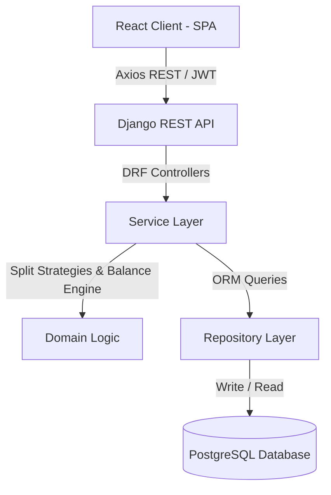
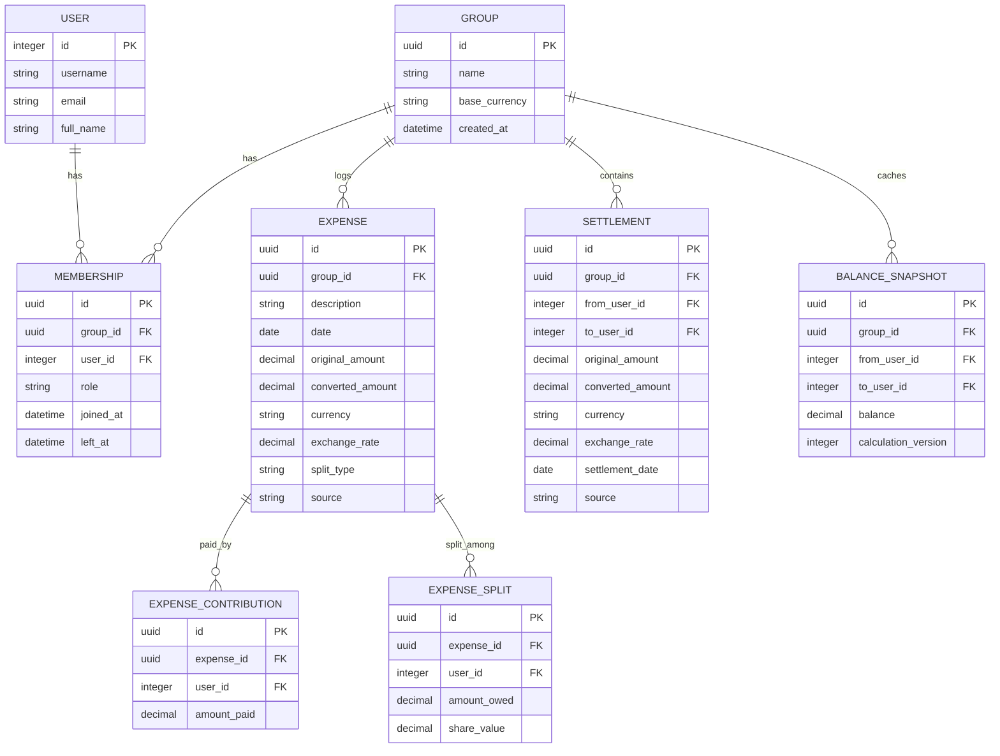
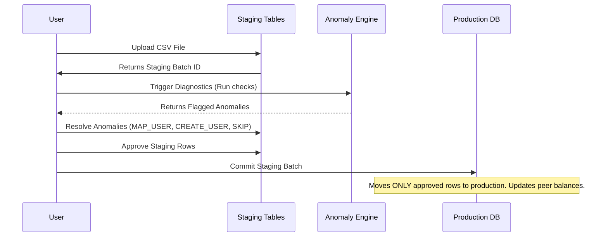

# Shared Expense Management Application (Antigravity Expenses Engine)

A premium, highly secure, and traceable expense splitting web application designed to manage house shares, trips, and roommate ledgers. The platform features direct bilateral balance tracking, in-memory ledger calculation breakdowns, a staging CSV import parser with interactive anomaly resolution workflows, and a glassmorphic user interface.

## 🚀 Live Deployment
- **Frontend URL:** [https://expenses-app-frontend.vercel.app](https://expenses-app-frontend.vercel.app) *(Demo Placeholder)*
- **Backend API URL:** [https://expenses-app-backend.railway.app](https://expenses-app-backend.railway.app) *(Demo Placeholder)*

---

## 🔑 Demo Credentials
To evaluate the application instantly with pre-loaded, realistic historical transactions, run the data seeder and sign in:
- **Email:** `demo@splitsmart.com`
- **Password:** `Demo@123`

---

## 🛠️ Technology Stack

### Frontend Stack (Pure JavaScript & JSX)
- **Core:** React 19, Vite 6, JavaScript (JSX)
- **Styling:** Tailwind CSS v4 (vanilla CSS configurations, custom Outfit & Inter typography)
- **State & Queries:** Axios, TanStack React Query (`@tanstack/react-query`)
- **Icons:** Lucide React

### Backend Stack
- **Framework:** Django 5.2, Django REST Framework (DRF)
- **Database:** PostgreSQL (Production), SQLite3 (Local Development)
- **Authentication:** JWT (Simple JWT) with auto-refresh mechanism

---

## 🏗️ Architecture

The project employs a clean separation of concerns with decoupled frontend and backend layers:



- **Domain Isolation:** CSV staging tables (`ImportBatch`, `ImportRow`, `ImportAnomaly`, `ImportResolution`) are completely isolated from production expense tables (`Expense`, `Settlement`) to ensure no unapproved transaction affects user balances.
- **Traceable Ledger:** Direct peer-to-peer (bilateral) debts are calculated, avoiding debt simplification. Balance positions are cached inside `BalanceSnapshot` models with a version tracking field, backed by in-memory transaction breakdowns for O(1) audit logs.

---

## 📊 Database Schema



---

## 🛠️ Setup Instructions

### 1. Backend Local Setup
1. Clone the repository and navigate to the backend folder:
   ```bash
   cd backend
   ```
2. Create and activate a virtual environment:
   ```bash
   python -m venv venv
   venv\Scripts\activate      # Windows
   source venv/bin/activate   # macOS/Linux
   ```
3. Install dependencies:
   ```bash
   pip install -r requirements.txt
   ```
4. Run migrations:
   ```bash
   python manage.py makemigrations
   python manage.py migrate
   ```
5. Seed demo data:
   ```bash
   python manage.py seed_demo_data
   ```
6. Start development server:
   ```bash
   python manage.py runserver
   ```

### 2. Frontend Local Setup
1. Open a new terminal and navigate to the frontend folder:
   ```bash
   cd frontend
   ```
2. Install dependencies:
   ```bash
   npm install
   ```
3. Set environment variables (create `.env` file):
   ```text
   VITE_API_URL=http://localhost:8000/api
   ```
4. Start development build:
   ```bash
   npm run dev
   ```

---

## 🔌 Core API Endpoints

### Authentication
- `POST /api/auth/signup/` — Registers a new user and logs them in.
- `POST /api/auth/login/` — Authenticates credentials and returns JWT access/refresh tokens.
- `POST /api/auth/token/refresh/` — Returns new access token using a valid refresh token.

### Groups & Memberships
- `GET /api/groups/` — Lists all groups the logged-in user has joined.
- `POST /api/groups/` — Creates a new group (owner auto-assigned).
- `GET /api/groups/<uuid:id>/` — Retrieves group details including active members.
- `POST /api/groups/<uuid:id>/members/` — Adds a new member (owner/admin restricted).

### Expenses & Settlements
- `GET /api/expenses/?group_id=<uuid>` — Lists active expenses for a group (member restricted).
- `POST /api/expenses/` — Records a manual expense (calculates splits instantly).
- `DELETE /api/expenses/<uuid:id>/` — Soft-deletes an expense and updates snapshots.
- `GET /api/settlements/?group_id=<uuid>` — Lists active repayments.
- `POST /api/settlements/` — Records a direct peer repayment.

### Balances & Traceability Reports
- `GET /api/groups/<uuid:id>/balances/` — Returns netted peer-to-peer balances.
- `GET /api/groups/<uuid:id>/balances/explanation/?from_user_id=<int>&to_user_id=<int>` — Returns the complete ledger breakdown of underlying expenses and settlements mapping to the net debt.

### CSV Import Staging
- `POST /api/imports/upload/` — Uploads raw CSV file with a `group_id`.
- `POST /api/imports/<uuid:batch_id>/detect/` — Runs diagnostic checks and registers anomalies.
- `GET /api/imports/batches/<uuid:batch_id>/` — Fetches batch rows, anomalies, and resolutions.
- `POST /api/imports/rows/<uuid:row_id>/resolve/` — Resolves row anomaly using mappings/user creations.
- `POST /api/imports/batches/<uuid:batch_id>/commit/` — Migrates APPROVED staging records into production.

---

## 📂 CSV Import Staging & Anomaly Resolution Workflow

To handle messy transactions and maintain database integrity, imports follow a strict staging-to-commit review workflow:



### Anomaly Detection Rules:
1. **`NEGATIVE_AMOUNT`:** Blocks rows with negative amounts.
2. **`INVALID_CURRENCY`:** Flags currency codes missing exchange rates.
3. **`UNKNOWN_MEMBER`:** Identifies names that do not match group members. Offers diacritics-folded token fuzzy matching suggestions.
4. **`MEMBERSHIP_VIOLATION`:** Flags if a matched member was inactive on the transaction date.
5. **`INVALID_SPLIT`:** Verifies that split math totals equal the amount (e.g. percentages sum to 100%).
6. **`SETTLEMENT_AS_EXPENSE`:** Flags settlements masquerading as expenses by matching keyword descriptions (e.g., "repay", "settle").
7. **`DUPLICATE_EXPENSE`:** Flags rows matching date, description, and amount in production or within the batch.
